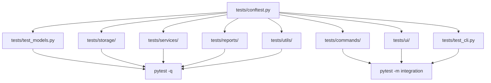
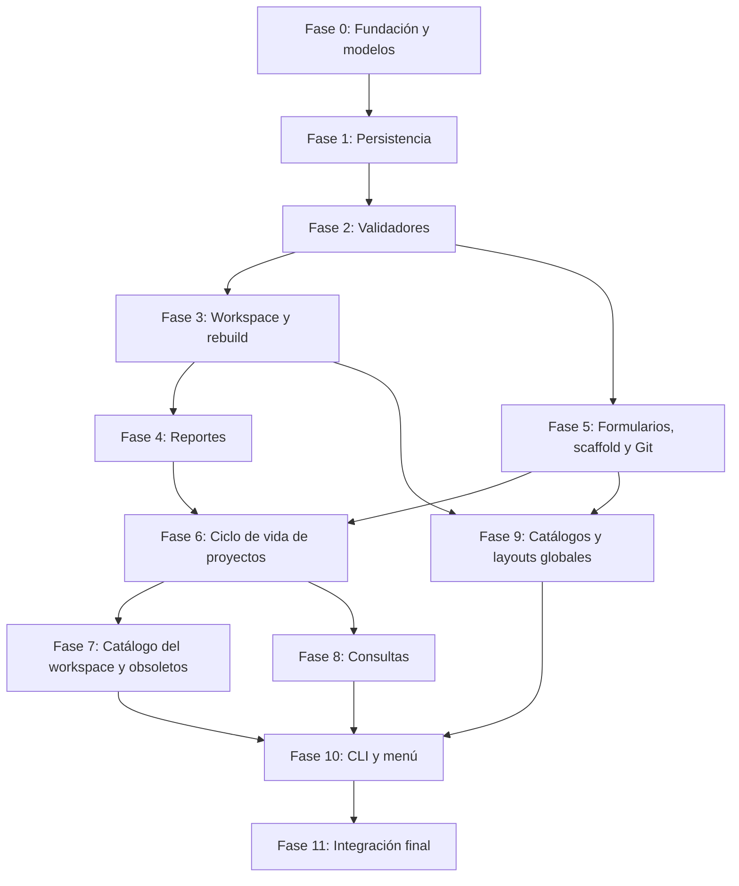

# Plan de Implementación - CLI Local Project Manager

Este documento describe las fases de construcción del paquete `local_project_manager`, ordenadas
por dependencia técnica. Cada fase produce entregables verificables antes de continuar con la
siguiente y está alineada con los RF y RN de
[01-contexto-y-objetivos.md](../architecture/01-contexto-y-objetivos.md). Se implementa el diseño
completo: no hay fases de MVP ni funcionalidades aplazadas. Ninguna fase se considera completa si el
código que produce carece de tests.

El modelo de dominio está en [06-modelo-de-dominio.md](../architecture/06-modelo-de-dominio.md),
las responsabilidades por módulo en [02-estrategia-solucion.md](../architecture/02-estrategia-solucion.md),
la estructura del paquete en [03-vista-bloques.md](../architecture/03-vista-bloques.md) y la
interfaz en [08-interfaz-cli.md](../architecture/08-interfaz-cli.md). Este documento se centra en
el orden de implementación, sus dependencias y sus criterios de cierre.

---

## Stack Tecnológico

La referencia de tecnologías está en [05-stack-tecnologico.md](../architecture/05-stack-tecnologico.md).
Nombres y versiones mínimas se declaran una sola vez en [`pyproject.toml`](../../pyproject.toml);
las versiones exactas, en `uv.lock`. Resumen:

| Capa                                      | Tecnologías                                                                                                                                                                                                                        | Uso en el proyecto                                                                                                                                                                                                                                                                                                             |
| ----------------------------------------- | ---------------------------------------------------------------------------------------------------------------------------------------------------------------------------------------------------------------------------------- | ------------------------------------------------------------------------------------------------------------------------------------------------------------------------------------------------------------------------------------------------------------------------------------------------------------------------------ |
| **Ejecución (externas)**                  | **Typer**, **Rich**, **Jinja2**, **PyYAML**                                                                                                                                                                                        | Typer define los grupos de subcomandos y aporta `CliRunner` para tests. Rich pinta el menú interactivo, los formularios, las tablas de `project list`/`search` y las confirmaciones. Jinja2 renderiza solo el Markdown de `meta/` desde `reports/templates/*.j2`. PyYAML lee y escribe catálogos, layouts y `.workspace.yaml`. |
| **Biblioteca estándar (uso obligatorio)** | `pathlib`, `dataclasses`, `typing`, `json`, `tempfile` + `os.replace`, `importlib.resources`, `importlib.metadata`, `re` + `unicodedata`, `string.Formatter`, `datetime`, `shutil`, `subprocess`, `collections.Counter`, `logging` | Rutas, las cuatro clases de dominio, manifiesto, escritura atómica, semillas empaquetadas, versión única, slugs e identificadores, detección de marcadores de layout, fechas ISO, mover y borrar proyectos, Git, conteos del dashboard, diagnóstico.                                                                           |
| **Desarrollo**                            | **uv**, **hatchling**, **pytest** + **pytest-cov**, **Ruff**, **mypy** (+ `types-PyYAML`), **pre-commit**, GitHub Actions (opcional)                                                                                               | Entorno y lockfile, build con layout `src/`, tests y cobertura, lint y formato (la regla `PTH` fuerza `pathlib`), tipado estricto, hooks locales y CI en Linux y Windows.                                                                                                                                                      |
| **Requisito externo**                     | Git en el `PATH`, Python 3.11 o superior                                                                                                                                                                                           | `utils/git.py` invoca la CLI de Git por `subprocess`.                                                                                                                                                                                                                                                                          |

**Evaluadas y no adoptadas** (motivo en el 05): pydantic, jsonschema, GitPython, ruamel.yaml,
python-slugify, questionary, platformdirs.

Cada fase indica en su bloque **Tecnologías de la fase** qué librerías y módulos introduce, de modo
que el `pyproject.toml` y el 05 se puedan revisar al cerrar la fase.

### Modelo que se construye

Dos conceptos independientes en el almacén global del CLI (`~/.local_project_manager/` o
`$LPM_HOME`): el **catálogo** (vocabulario de valores) y el **layout** (esqueleto de proyecto). Al
crear un workspace se copian a `.workspace.yaml` y a `.layouts/base.yaml`, y desde ahí evolucionan
solos. No hay revisiones ni procedencia por proyecto. Un valor del catálogo que siguen usando
proyectos no se elimina: se marca obsoleto.

Cuatro clases de dominio, una por archivo: `Catalog`, `Workspace`, `ProjectLayout` y `Project`.
`Project` es plano en memoria y anidado en `.project.json` mediante la tabla `BLOCKS`.

---

## Estado Actual de Implementación

> Tabla de seguimiento manual. Actualizar al cerrar cada entregable. Leyenda: Completa (código +
> tests en verde) - Parcial - No Iniciada.
>
> **Nota (2026-09-21):** el repositorio contiene la documentación refactorizada, `pyproject.toml`
> y el esqueleto `src/local_project_manager/` con `__init__.py` (`__version__`), `constants.py`
> (nombres del diseño anterior, pendiente de actualizar), `models.py` y `config.py` vacíos, y los
> paquetes `commands/`, `services/`, `generator/` y `utils/` vacíos. No existe `tests/`. La Fase 0
> se marca Parcial; el resto, No Iniciada.

| Fase                                        | Estado      | Dependencia    |
| ------------------------------------------- | ----------- | -------------- |
| Fase 0 — Fundación y modelos                | Parcial     | —              |
| Fase 1 — Persistencia (`storage/`)          | No Iniciada | Fase 0         |
| Fase 2 — Validadores                        | No Iniciada | Fase 1         |
| Fase 3 — Creación del workspace y rebuild   | No Iniciada | Fase 2         |
| Fase 4 — Motor de reportes                  | No Iniciada | Fase 3         |
| Fase 5 — Formularios, scaffold y Git        | No Iniciada | Fase 2         |
| Fase 6 — Ciclo de vida de proyectos         | No Iniciada | Fases 4 y 5    |
| Fase 7 — Catálogo del workspace y obsoletos | No Iniciada | Fase 6         |
| Fase 8 — Consultas y búsqueda               | No Iniciada | Fase 6         |
| Fase 9 — Catálogos y layouts globales       | No Iniciada | Fases 3 y 5    |
| Fase 10 — CLI, menú y punto de entrada      | No Iniciada | Fases 7, 8 y 9 |
| Fase 11 — Integración final                 | No Iniciada | Fase 10        |

---

## Estrategia de Testing

Cada fase, desde la Fase 0, incluye entregables de pruebas con `pytest`. El criterio de completitud
de toda fase exige que sus pruebas pasen en verde, no solo que el código exista.

**Convenciones:**

- Framework: `pytest` + `pytest-cov`.
- Estructura: carpeta `tests/` en la raíz del repo, espejo de `src/local_project_manager/`
  (`tests/test_models.py`, `tests/storage/`, `tests/services/`, `tests/reports/`,
  `tests/commands/`, `tests/ui/`, `tests/utils/`, `tests/test_cli.py`).
- Fixtures compartidas en `tests/conftest.py`: almacén global temporal (`LPM_HOME` apuntando a
  `tmp_path`), workspace temporal ya creado con el catálogo base, `Catalog`, `ProjectLayout` y
  `Project` válidos de referencia.
- Nomenclatura: archivos `test_<módulo>.py`, funciones `test_<comportamiento_esperado>`.
- Marcadores: `@pytest.mark.integration` para pruebas que tocan Git o la CLI de extremo a extremo;
  el resto se trata como unitarias aunque usen `tmp_path`.
- Cobertura objetivo: ≥85% en `models.py`, `storage/`, `services/` y `reports/`. En `commands/` y
  `ui/` se prioriza la prueba de integración sobre el número de cobertura.
- Ejecución local: `pytest -q` (rápido) y
  `pytest --cov=local_project_manager --cov-report=term-missing` (con cobertura).

---

## Fase 0 — Fundación y Modelos

**Objetivo:** Establecer el esqueleto del paquete con la estructura definida en el 03 y las cuatro
clases de dominio.

**Entregables:**

- Estructura de paquetes: `storage/`, `services/`, `reports/` (con `templates/`), `commands/`,
  `ui/`, `utils/` y `resources/`. Eliminar `generator/`.
- `__init__.py` raíz con `__version__` (ya existe).
- `constants.py` actualizado: `APP_HOME_DIRNAME`, `TEMPLATES_DIRNAME`, `CATALOGS_DIRNAME`
  (`catalogs`), `LAYOUTS_DIRNAME`, `CUSTOM_DIRNAME`, `WORKSPACE_FILENAME`, `WORKSPACE_LAYOUTS_DIRNAME`
  (`.layouts`), `PROJECT_MANIFEST_FILENAME`, `META_DIRNAME`, `MANIFEST_VERSION`, `SCHEMA_VERSION`,
  `BASE_ID` (`base`), `DEFAULT_PATH_PATTERN`, `LAYOUT_MARKERS`, `PATTERN_MARKERS`. Eliminar
  `BASE_TEMPLATE_REVISION`.
- `models.py` con `Catalog`, `Workspace`, `ProjectLayout` y `Project`; alias `ObsoleteValues`;
  tabla `BLOCKS` y `Project.to_dict()` / `Project.from_dict()`; `empty_obsolete_values()`.
- `config.py`: `resolve_workspace(path | None)` (opción o cwd) y `resolve_home()` (`LPM_HOME` o
  `~/.local_project_manager/`), sin tocar disco.
- `tests/conftest.py` con las fixtures compartidas.
- `tests/test_models.py`: construcción de las cuatro clases, `BLOCKS` cubre exactamente los campos
  de `Project`, round-trip `to_dict()`/`from_dict()` sin pérdida, error claro ante clave ausente.

**Tecnologías de la fase:** `dataclasses` (`slots=True`; `field(default_factory=...)` para listas y
mapas), `typing`, `pathlib` y `os.environ` en `config.py`, `importlib.metadata` para
`__version__`. Tooling: hatchling, uv, pytest + pytest-cov, Ruff y mypy estricto.

**Criterio de completitud:** Los módulos son importables entre sí sin errores. `pytest -q` pasa en
verde con cobertura ≥85% sobre `models.py`. No hay referencias a `TechStack`, `TemplateBinding`,
`CatalogDefinition` ni `WorkspaceConfig` en el código.

---

## Fase 1 — Persistencia (`storage/`)

**Objetivo:** Implementar los cuatro stores y la escritura atómica, y empaquetar las semillas base.

**Entregables:**

- `resources/catalogs/base.yaml` y `resources/layouts/base.yaml` con el contenido del 07.
- `storage/atomic.py`: `write_text(path, content)` con temporal en el mismo directorio y
  `os.replace` (RN-402).
- `storage/catalog_store.py`: `list()`, `load()`, `save()`, `delete()`, `ensure_base()`; rechaza
  `save`/`delete` sobre `base`; deriva base/custom de la carpeta.
- `storage/layout_store.py`: mismas operaciones en dos ámbitos (global y `.layouts/` del
  workspace); `ensure_base()` global.
- `storage/workspace_store.py`: `exists()`, `load()`, `save()`; `save` actualiza `updated_at`.
- `storage/project_store.py`: `load()`, `save()`, `delete()`, `scan()` recursivo que ignora
  `meta/` y `.layouts/`, `resolve_path()` que aplica `project_path_pattern` (RN-606).
- Los stores devuelven modelos, nunca diccionarios; un archivo con forma inválida produce un error
  con ruta y campo.
- `tests/storage/test_atomic.py`, `test_catalog_store.py`, `test_layout_store.py`,
  `test_workspace_store.py`, `test_project_store.py`: round-trips, materialización de semillas,
  protección de `base`, `scan` con proyectos anidados y `resolve_path` con los tres patrones del 04.

**Tecnologías de la fase:** `json` (`indent=4`, `ensure_ascii=False`); PyYAML `safe_load` y
`safe_dump(sort_keys=False, allow_unicode=True)`; `tempfile.NamedTemporaryFile(delete=False)` +
`os.replace`; `importlib.resources.files()` para las semillas.

**Criterio de completitud:** Se puede materializar el almacén global desde cero, cargar y guardar
los cuatro tipos de archivo y recorrer un workspace completo. Las pruebas de `tests/storage/` pasan
en verde.

---

## Fase 2 — Validadores

**Objetivo:** Implementar los tres validadores y las utilidades de normalización que usan.

**Entregables:**

- `utils/slug.py`: `normalize_id(text)` y `slugify(name)` (`[a-z0-9-]`, `+` en tags), `is_valid_id`.
- `utils/dates.py`: `today_iso()` y `is_iso_date()`.
- `services/catalog_validator.py`: invariantes de `Catalog` del 06 (RN-105, RN-106).
- `services/layout_validator.py`: rutas relativas sin `..`, sin `.project.json`, marcadores
  conocidos en rutas y contenidos usando `string.Formatter().parse` (RN-802..804).
- `services/project_validator.py`: campos obligatorios, slug válido y único, `type` según
  categoría, valores vigentes u obsoletos ya asignados, `framework` según RN-106, fechas,
  `archived_at` solo con `archived`, `depends_on` existentes y sin ciclos (RN-102..107, RN-201,
  RN-202, RN-501..504).
- Validación de `project_path_pattern` (`{slug}` obligatorio, marcadores permitidos, `{type}` si
  hay `{category}` y tipos) en `services/catalog_validator.py` o módulo propio.
- Todos devuelven `list[str]` con todos los errores, no lanzan en el primero.
- `tests/services/test_catalog_validator.py`, `test_layout_validator.py`,
  `test_project_validator.py`, `tests/utils/test_slug.py`, `test_dates.py`: matriz de casos
  válidos e inválidos por regla con verificación del mensaje.

**Tecnologías de la fase:** `re` + `unicodedata.normalize("NFKD")`; `datetime.date.fromisoformat`;
`string.Formatter`; detección de ciclos con DFS sobre `depends_on`. Sin pydantic.

**Criterio de completitud:** Ningún `Catalog`, `ProjectLayout` ni `Project` inválido pasa un
validador, y cada error es trazable a una RN. Las pruebas pasan en verde.

---

## Fase 3 — Creación del Workspace y Rebuild

**Objetivo:** Implementar `workspace create` y `workspace rebuild`, el esqueleto de `meta/` y la
apertura validada de un workspace.

**Entregables:**

- `services/scaffold_service.py` (parte 1): `create_category_dirs(root, workspace)` según patrón
  (RN-606; categorías sin tipos, patrón sin `{type}`).
- `services/rebuild_service.py`: `run(root, workspace)` que escanea proyectos, calcula agregados
  con `Counter`, genera todo `meta/` en un directorio temporal y lo intercambia (RN-401, RN-402);
  reporta y excluye manifiestos inválidos.
- `commands/workspace.py`: `create` (elige catálogo global o crea uno, patrón de rutas, copia
  `.workspace.yaml` y `.layouts/base.yaml`, crea directorios, rebuild inicial; rechaza si ya existe
  `.workspace.yaml`) y `rebuild`. Función `open_workspace(path)` compartida por todos los comandos
  (RF-103).
- `tests/commands/test_workspace_create.py`: estructura resultante con el catálogo base, rechazo
  sobre workspace existente, patrón custom, `source_catalog_id` informativo.
- `tests/services/test_rebuild_service.py`: workspace vacío deja índices en cero y sin fichas;
  manifiesto corrupto se excluye con aviso; atomicidad ante fallo simulado.

**Tecnologías de la fase:** `pathlib.mkdir(parents=True, exist_ok=True)`; `shutil.copyfile` y
`tempfile.mkdtemp` + `os.replace` para el intercambio de `meta/`; `collections.Counter`; `logging`
con `RichHandler` para `--verbose`.

**Criterio de completitud:** `workspace create` deja un workspace válido y `open_workspace` lo
reconoce. `workspace rebuild` sobre workspace vacío deja índices base correctos y ninguna ficha.
Las pruebas pasan en verde.

---

## Fase 4 — Motor de Reportes

**Objetivo:** Renderizar los tres documentos Markdown de `meta/` con Jinja2.

**Entregables:**

- `reports/templates/global-index.md.j2`, `category-index.md.j2`, `project-data.md.j2` según los
  mockups del 03.
- `reports/meta_io.py`: `render_global_index`, `render_category_index`, `render_project_doc`;
  traducen identificadores a etiquetas con `workspace.catalog` y marcan `(obsoleto)` con
  `workspace.obsolete_values` (RF-301..304).
- Materialización condicional de `projects/` (RF-304). Categorías obsoletas con proyectos siguen
  generando su índice.
- `tests/reports/test_meta_io.py`: contenido esperado con y sin proyectos, etiquetas legibles,
  marca de obsoleto, `projects/` condicional.

**Tecnologías de la fase:** Jinja2 con `PackageLoader("local_project_manager.reports", "templates")`,
`StrictUndefined`, `autoescape=False`, `trim_blocks`, `lstrip_blocks`; filtros propios para
tablas Markdown.

**Criterio de completitud:** Los reportes coinciden estructuralmente con los mockups del 03 y
`rebuild_service` los produce completos. Las pruebas pasan en verde.

---

## Fase 5 — Formularios, Scaffold y Git

**Objetivo:** Construir las piezas transversales que necesitan los comandos de proyectos: entrada
interactiva con valores vigentes, materialización de layouts e integración con Git.

**Entregables:**

- `ui/prompts.py`: selección entre valores vigentes con opción `include_obsolete`, formulario de
  proyecto, formulario de edición con aviso de obsoletos (mantener o actualizar), confirmaciones,
  muestra de listas de errores completas (RF-403, RN-302).
- `services/scaffold_service.py` (parte 2): `materialize(layout, project, target)` que crea
  `directories`, escribe `files` con marcadores sustituidos por `str.format_map` en rutas y
  contenidos, y ejecuta `git init` si `init_git` (RN-801..805).
- `utils/git.py`: `init(path)` y `clone(url, dest)` con `shutil.which("git")` y `subprocess.run`
  sin `shell=True` (RF-404).
- `tests/ui/test_prompts.py`: solo valores vigentes por defecto, obsoletos marcados con la opción,
  entradas simuladas con `monkeypatch`.
- `tests/services/test_scaffold_service.py`: layout base, layout con subdirectorios en rutas,
  llaves dobladas en TOML, `init_git` (marcado `integration`).
- `tests/utils/test_git.py` (`integration`): `init` y `clone` contra un repositorio temporal real.

**Tecnologías de la fase:** Rich `Prompt.ask(choices=...)`, `Confirm.ask`, `Table`;
`sys.stdin.isatty()` para fallar limpio en CI; `str.format_map` con un `dict` de marcadores;
`subprocess.run([...], check=True, capture_output=True, text=True)`.

**Criterio de completitud:** Los formularios ofrecen únicamente valores vigentes salvo opción
explícita. Un layout se materializa exactamente como describe el 06. Las pruebas pasan en verde.

---

## Fase 6 — Ciclo de Vida de Proyectos

**Objetivo:** Implementar `project new`, `register`, `edit`, `move`, `delete` y `show`, todos con
validación previa y rebuild automático (RN-401).

**Entregables:**

- `commands/project.py`:
  - `new`: elegir layout de `.layouts/`, formulario, slug desde `name`, validación,
    `resolve_path`, clonar o materializar, escribir `.project.json`, rebuild (RF-201, RF-404).
  - `register <ruta>`: misma recogida de datos, solo escribe `.project.json` en una ruta
    existente que respete el patrón y no tenga manifiesto (RF-205, RN-505).
  - `edit <slug>`: campos permitidos, aviso de obsoletos, `dates.modified`, rebuild (RF-202,
    RN-303).
  - `move <slug> --category --type`: recalcular ruta, `shutil.move`, actualizar manifiesto,
    rebuild (RF-203).
  - `delete <slug>`: confirmación explícita, `shutil.rmtree`, rebuild (RF-204, RN-302).
  - `show <slug>`: ficha en terminal con obsoletos marcados.
- `tests/commands/test_project_new.py`, `test_project_register.py`, `test_project_edit.py`,
  `test_project_move.py`, `test_project_delete.py`, `test_project_show.py`: camino feliz,
  validación previa a escritura, inmutabilidad de `slug`/`category`/`type` en `edit`, no
  destrucción en `register`, confirmación en `delete`, rebuild en cada mutación.

**Tecnologías de la fase:** `shutil.move` y `shutil.rmtree` (con `onexc` para solo lectura en
Windows); `datetime.date.today().isoformat()`; Rich `Confirm`.

**Criterio de completitud:** Ninguna operación escribe en disco sin validación previa. `register`
conserva intactos todos los archivos previos. Cada comando termina con `meta/` actualizado. Las
pruebas pasan en verde.

---

## Fase 7 — Catálogo del Workspace y Valores Obsoletos

**Objetivo:** Implementar la edición del catálogo del workspace con la semántica de obsoletos.

**Entregables:**

- `services/obsolete_service.py`: `remove(workspace, projects, field, value)` (borrado físico o
  alta en `obsolete_values` según uso), `restore(workspace, field, value)`, `review(workspace,
  projects)` que devuelve un informe de cambios antes de aplicarlos (RN-701..705). Detección de
  uso por campo: `statuses`→`status`, `categories`→`category`, `types_by_category`→`type`,
  `languages`→`language`, `frameworks_by_language`→`framework`, `default_tags_by_type`→ninguno
  (siempre borrable), `priorities`→`priority`.
- `commands/workspace.py` (ampliación): `catalog show [--include-obsolete]`, `catalog add`,
  `catalog remove`, `catalog restore`, `catalog review` (RF-606..609). `add` y `remove` de
  categorías o tipos crean directorios y disparan rebuild.
- `tests/services/test_obsolete_service.py`: eliminar sin uso, eliminar con uso, restaurar,
  revisar en los dos sentidos, `obsolete_values` siempre con todas las claves.
- `tests/commands/test_workspace_catalog.py`: cada subcomando, validación del catálogo resultante,
  ningún `.project.json` reescrito (comparación byte a byte antes y después).

**Tecnologías de la fase:** sin dependencias nuevas; `dataclasses.replace` para producir el
`Workspace` modificado; Rich `Table` para el resumen de `review`.

**Criterio de completitud:** Un valor en uso nunca desaparece del catálogo; uno sin uso desaparece
físicamente; `review` reconcilia ambos sentidos; ningún manifiesto cambia. Las pruebas pasan en
verde.

---

## Fase 8 — Consultas y Búsqueda

**Objetivo:** Implementar `project list` y `project search`.

**Entregables:**

- `commands/project.py` (ampliación): `list` con filtros `--category`, `--type`, `--status`,
  `--priority` en AND (RF-401) y `search <término>` sobre `name`, `description` y `tags` (RF-402),
  ambos en tabla Rich con obsoletos marcados y mensaje claro sin resultados.
- `tests/commands/test_project_list.py`, `test_project_search.py`: filtros combinados, marca de
  obsoletos, sin resultados.

**Tecnologías de la fase:** Rich `Table`; filtrado con comprensiones sobre `ProjectStore.scan()`.

**Criterio de completitud:** `list` sin filtros muestra todos los proyectos; con filtros restringe
correctamente; `search` sin coincidencias informa en lugar de mostrar una tabla vacía. Las pruebas
pasan en verde.

---

## Fase 9 — Catálogos y Layouts Globales, Layouts del Workspace

**Objetivo:** Implementar la gestión de plantillas del almacén global y de los layouts del
workspace.

**Entregables:**

- `commands/catalog.py`: `list`, `show`, `create [--from]`, `edit`, `delete` sobre el almacén
  global; `base` protegido; validación completa antes de sobrescribir; no requiere workspace
  (RF-601..605, RN-601, RN-602).
- `commands/layout.py`: `list`, `show`, `create [--from]`, `edit`, `delete` sobre el almacén
  global; `base` protegido (RF-701..705, RN-806).
- `commands/workspace.py` (ampliación): `layout list`, `show`, `create [--from]`, `edit` (incluido
  `base` del workspace), `delete` (no `base`), `import <layout_id>` sin sobrescribir (RF-702..706).
- `ui/prompts.py` (ampliación): editores guiados de catálogo (listas y mapas) y de layout
  (directorios, archivos con contenido multilínea, `init_git`).
- `tests/commands/test_catalog.py`, `test_layout.py`, `test_workspace_layout.py`: crear desde cero
  y desde otro, editar con validación, protección de `base`, `import` sin sobrescritura, ningún
  workspace existente cambia al editar un global.

**Tecnologías de la fase:** sin dependencias nuevas. Edición de contenidos multilínea mediante
`click.edit()` (incluido en Typer) con fallback a entrada por líneas.

**Criterio de completitud:** El ciclo completo de catálogos y layouts custom funciona con y sin
workspace, `base` es intocable en el almacén global, y editar un global no altera ningún
workspace. Las pruebas pasan en verde.

---

## Fase 10 — CLI, Menú y Punto de Entrada

**Objetivo:** Conectar todos los comandos bajo la aplicación Typer y el menú interactivo.

**Entregables:**

- `cli.py`: app Typer con los grupos `workspace`, `project`, `catalog` y `layout`, opción global
  `--workspace`, `--help` descriptivo, códigos de salida `0`/`1`/`2` del 08; sin argumentos lanza
  el menú.
- `ui/menu.py`: menú del 08 que invoca las mismas funciones de `commands/`.
- `__main__.py` y script de consola `lpm` (ya declarado en `pyproject.toml`).
- `tests/test_cli.py`: `--help` de cada grupo y subcomando, códigos de salida, delegación a
  `commands/` con spies, `--workspace` inválido devuelve `2`.
- `tests/ui/test_menu.py`: navegación con entradas simuladas hasta cada hoja del menú.

**Tecnologías de la fase:** Typer (`typer.Typer`, `add_typer`, `typer.Exit`,
`typer.testing.CliRunner`); Rich para el menú.

**Criterio de completitud:** `lpm --help` muestra los cuatro grupos y cada subcomando tiene su
ayuda. `lpm` sin argumentos abre el menú y cada opción llega al comando correcto. Las pruebas pasan
en verde.

---

## Fase 11 — Integración y Validación Final

**Objetivo:** Verificar los flujos completos de extremo a extremo y cerrar la documentación.

**Entregables:**

- Prueba de flujo principal (`integration`, contra `tmp_path` real, `LPM_HOME` temporal):
  `catalog create --from base` → `workspace create` con ese catálogo → `workspace layout create
  --from base` → `project new` (×N, dos layouts) → `project register` → `project list` →
  `project search` → `project edit` → `project move` → `workspace catalog remove` de un valor en
  uso (queda obsoleto) → `workspace catalog review` → `workspace rebuild` → `project delete` →
  `workspace catalog review` (el valor desaparece).
- Verificación de que `meta/` coincide con los manifiestos tras cada paso.
- Verificación de que editar el catálogo global tras crear el workspace no cambia
  `.workspace.yaml`.
- `README.md` y `CHANGELOG.md` actualizados con el estado final.
- `pytest --cov=local_project_manager --cov-report=term-missing` en verde con cobertura ≥85% en
  `models.py`, `storage/`, `services/` y `reports/`.

**Tecnologías de la fase:** pytest-cov; pre-commit con Ruff y mypy; GitHub Actions con matriz
Linux + Windows si el repositorio se aloja en GitHub.

**Criterio de completitud:** El flujo completo pasa en un workspace temporal real. La
documentación describe el sistema tal y como quedó. La suite entera pasa en verde y la cobertura
cumple el objetivo.

---

## Mapa de Dependencias entre Fases

---

## Checklist de Cierre

Antes de dar por terminada la aplicación, verificar cada punto (criterio SI/NO):

- [ ] ¿`models.py` contiene exactamente `Catalog`, `Workspace`, `ProjectLayout` y `Project`, y `BLOCKS` cubre todos los campos de `Project`? (Fase 0)
- [ ] ¿Existe `tests/` espejo de `src/local_project_manager/` con `conftest.py` y fixtures de almacén global y workspace temporales? (Fase 0)
- [ ] ¿`pytest -q` pasa en verde sin errores ni warnings sobre toda la suite?
- [ ] ¿La cobertura de `models.py`, `storage/`, `services/` y `reports/` es ≥85%?
- [ ] ¿Toda escritura pasa por `storage/atomic.py`? (RN-402)
- [ ] ¿`workspace create` rechaza un directorio que ya tiene `.workspace.yaml` y `open_workspace` rechaza uno inválido? (RF-101, RF-103)
- [ ] ¿`workspace rebuild` sobre un workspace vacío deja índices en cero y no genera fichas? (Fases 3 y 4)
- [ ] ¿`slug`, `category` y `type` son inmutables tras `project edit`? (RN-303)
- [ ] ¿`project delete`, `catalog delete` y `layout delete` exigen confirmación? (RN-302)
- [ ] ¿Cada mutación de proyectos y cada alta o baja de categorías o tipos dispara rebuild? (RN-401)
- [ ] ¿Eliminar un valor en uso lo marca obsoleto sin tocar ningún `.project.json`, y `review` lo elimina cuando deja de usarse? (RN-701, RN-704, RN-705)
- [ ] ¿Editar un catálogo o layout global no modifica ningún workspace existente? (RN-604)
- [ ] ¿`base` es intocable en el almacén global y `.layouts/base.yaml` es editable pero no borrable? (RN-601, RN-806)
- [ ] ¿Ningún layout puede declarar `.project.json` ni rutas con `..`? (RN-802, RN-803)
- [ ] ¿`lpm` sin argumentos abre el menú y cada opción llega al mismo comando que su subcomando? (Fase 10)
- [ ] ¿Existen `README.md` y `CHANGELOG.md` actualizados con el estado final?
- [ ] ¿`__version__` está declarado en `__init__.py` y es consistente con el `CHANGELOG.md`?
- [ ] ¿Las dependencias de `pyproject.toml` coinciden con [05-stack-tecnologico.md](../architecture/05-stack-tecnologico.md)?
- [ ] ¿La tabla "Estado Actual de Implementación" refleja la realidad del código?
